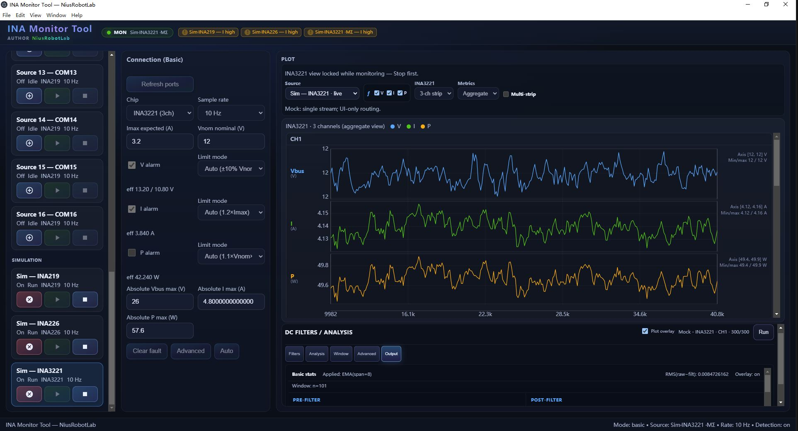
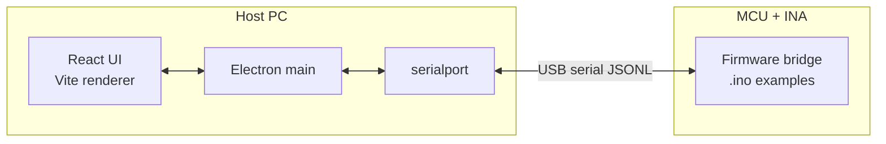

<div align="center">

<pre>
███╗   ██╗██╗██╗   ██╗███████╗██████╗  ██████╗ ██████╗  ██████╗ ████████╗
████╗  ██║██║██║   ██║██╔════╝██╔══██╗██╔═══██╗██╔══██╗██╔═══██╗╚══██╔══╝
██╔██╗ ██║██║██║   ██║███████╗██████╔╝██║   ██║██████╔╝██║   ██║   ██║   
██║╚██╗██║██║██║   ██║╚════██║██╔══██╗██║   ██║██╔══██╗██║   ██║   ██║   
██║ ╚████║██║╚██████╔╝███████║██║  ██║╚██████╔╝██████╔╝╚██████╔╝   ██║   
╚═╝  ╚═══╝╚═╝ ╚═════╝ ╚══════╝╚═╝  ╚═╝ ╚═════╝ ╚═════╝  ╚═════╝    ╚═╝   

██╗      █████╗ ██████╗ 
██║     ██╔══██╗██╔══██╗
██║     ███████║██████╔╝
██║     ██╔══██║██╔══██╗
███████╗██║  ██║██████╔╝
╚══════╝╚═╝  ╚═╝╚═════╝ 
</pre>

# INA Monitor

### Precision power analytics for INA-series shunt monitors

[](LICENSE)
[](package.json)
[](https://www.electronjs.org/)
[](https://react.dev/)

[]()
[]()
[]()

<br/>

**Cross-platform desktop instrument** — real-time visualization, serial bridging, and extensible analysis pipelines for **INA219**, **INA226**, **INA228**, **INA3221**, and related energy-monitor ICs.

<br/>


### Crafted by [**NiusRobotLab**](https://github.com/NiusRobotLab) — robotics-grade tooling for makers & engineers

<br/>

</div>

---

## Highlights

| | |
|:---:|:---|
| **Live dashboard** | Multi-channel metrics, fault awareness, and a data pipeline tuned for bench & field use |
| **Input sources** | **16** independent **serial stream** slots (USB JSONL) plus **3** built-in **mock** (simulated) sources for INA219 / INA226 / INA3221 — no hardware required for demos |
| **Serial bridge** | JSONL protocol over USB serial — pair with firmware examples in `packages/arduino-bridge` |
| **Modern stack** | **Electron** + **Vite** + **React** + **TypeScript** — fast HMR in dev, optimized renderer in prod |
| **Core library** | `@niusrobotlab/ina-monitor-core` — shared models, transports, and protection logic |

<p align="center">
  
  <br/>
  <sub>Reference screenshot (<code>assets/screenshot.JPG</code>): up to <strong>16</strong> concurrent serial streams and <strong>3</strong> simulated mock streams.</sub>
</p>

---

## Architecture



---

## Quick start

```bash
git clone https://github.com/NiusRobotLab/NiusRobotLab_INA_monitor.git
cd NiusRobotLab_INA_monitor
npm install
npm run dev
```

- **Development** runs Vite on `:5173` and launches Electron with hot reload. The UI resolves `@niusrobotlab/ina-monitor-core` from **TypeScript sources**, so you do **not** need to build the core package first.
- **Production build** (after `npm run build`):

```bash
npm run start:app
```

### `npm run dev` — what happens (avoid silent failures)

1. **Electron main/preload are compiled first**  
   The app package defines **`predev`** → **`npm run build:electron`**, which runs **`tsc`** for the Electron **main** process and **preload** script into **`packages/ina-monitor-app/dist-electron/`**.  
   **Why:** Electron’s entry is `dist-electron/main.js`. If that folder is missing (fresh clone, cleanup, or deleted `dist-electron`), Electron exits with **code 1** and almost no useful log. Running **`build:electron` before** Vite + Electron prevents that.

2. **Port `5173` must be free**  
   Vite listens on **`http://localhost:5173/`**; the dev script waits for that port before starting Electron. If something else already uses **5173**, Vite fails with *“Port 5173 is already in use”* and the whole `dev` command may exit with code **1** (not an Electron bug — fix by closing the other dev server or freeing the port). To use another port, change Vite’s `server.port` and the **`wait-on tcp:<port>`** string in `packages/ina-monitor-app/package.json` so they match.

---

## Workspace layout

| Package | Role |
|--------|------|
| `@niusrobotlab/ina-monitor-core` | Types, protocols, fault engine, transports (library) |
| `@niusrobotlab/ina-monitor-app` | Electron shell + React UI |
| `arduino-bridge` | Example sketches for common breakout boards |

---

## Scripts (root)

| Command | Description |
|--------|-------------|
| `npm run dev` | Start Vite + Electron in development; **`predev`** runs **`build:electron`** first (writes `dist-electron/`) |
| `npm run build` | Build core, then renderer + Electron main/preload |
| `npm run start:app` | Run packaged Electron app (requires build first) |
| `npm run test` | Run core unit tests |
| `npm run lint` | ESLint (flat config) |

---

## Development & build requirements

### All platforms

| Requirement | Notes |
|-------------|--------|
| **Node.js** | **≥ 18** (current **LTS** recommended: 20.x or 22.x) |
| **npm** | Comes with Node; **workspaces** are used (default in npm 7+) |
| **Git** | For cloning and version control |
| **Disk / RAM** | ~500 MB for `node_modules` (varies); **≥ 4 GB RAM** recommended for comfortable dev |

The app depends on **[`serialport`](https://www.npmjs.com/package/serialport)** (native Node addon). `npm install` usually downloads **prebuilt binaries**. If a prebuild is missing for your OS/CPU/Node combo, npm falls back to **compiling from source**, which needs the toolchain below.

---

### Windows

| Item | Purpose |
|------|---------|
| **Windows 10 / 11** (64-bit; **ARM64** supported where Node/Electron builds exist) | Host OS |
| **[Node.js Windows Installer](https://nodejs.org/)** (LTS) | Node + npm; enable “Tools for native modules” if the installer offers it |
| **Build tools (if native compile is required)** | Install **[Visual Studio Build Tools](https://visualstudio.microsoft.com/visual-cpp-build-tools/)** with **“Desktop development with C++”** (MSVC, Windows SDK), *or* full **Visual Studio** with the same workload — required when `serialport` must compile via `node-gyp` |
| **Python 3.x** | Often required by `node-gyp` when building native addons (install from [python.org](https://www.python.org/) and ensure `python` is on `PATH`) |

**Tips:** Run the terminal **as Administrator** only if installs fail due to permission issues. Use **PowerShell** or **cmd**; **Git Bash** works but paths must remain consistent. If USB serial access fails, install the board’s USB driver (e.g. CP210x, CH340, FTDI) from the vendor.

---

### Linux

| Item | Purpose |
|------|---------|
| **glibc-based** distros (Debian, Ubuntu, Fedora, etc.) | Most tested; **musl** (Alpine) may need extra steps for Electron/native modules |
| **`build-essential`** (Debian/Ubuntu) or **`gcc`**, **`make`**, **`python3`** | Toolchain if `serialport` builds from source |
| **`libudev-dev`** (Debian/Ubuntu) or **`systemd-devel`** / equivalent | Headers for serial port enumeration (`udev`) |

**Debian / Ubuntu example:**

```bash
sudo apt update
sudo apt install -y build-essential python3 git
sudo apt install -y libudev-dev   # for node-serialport
```

**Fedora example:**

```bash
sudo dnf groupinstall -y "Development Tools"
sudo dnf install -y python3 git systemd-devel pkgconf-pkg-config
```

Grant your user access to serial devices if needed (e.g. add user to **`dialout`** on Debian/Ubuntu: `sudo usermod -aG dialout $USER`, then re-login).

---

### macOS

| Item | Purpose |
|------|---------|
| **macOS 11+** (Big Sur or newer recommended) | Matches current Electron support |
| **Xcode Command Line Tools** | `clang`, `make` for any native compile: `xcode-select --install` |
| **Python 3** | Bundled or via Homebrew if `node-gyp` asks for it |

Install Node via the [official installer](https://nodejs.org/) or **Homebrew** (`brew install node@20`). Approve any Gatekeeper prompts when Electron first runs.

---

### Verify your environment

```bash
node -v    # should print v18.x or higher
npm -v
```

Then from the repo root: `npm install` and `npm run dev`.

---

## License

This project is released under the [**MIT License**](LICENSE).

---

<div align="center">

<br/>

### Built with precision by **NiusRobotLab**

*Open hardware. Open software. Measure everything that matters.*

[](https://github.com/NiusRobotLab)

<br/>


</div>
